### 基本概念

所有的 PID 都可以归为模拟 PID 和数字 PID 两大类。  
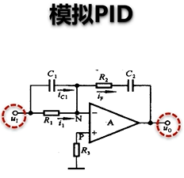

- 模拟 PID 通过搭建控制电路实现的
- 数字 PID:通过编程实现
    
  PID 控制器在时间坐标下的连续表达式：  
  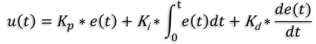  
  PID 控制器的离散表达式：  
  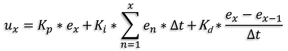  
  公式里的 △t 是一个常量，因此可以跟比例系数 Kp 和微分系数 Kd 合并，可以得到位置式 PID 算法的公式：  
    
  **当前时刻的位置式 PID-上一时刻的 PID，可以得到增量式 PID 的表达式：**  
  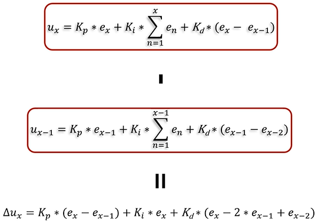  
  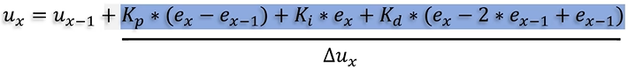  
  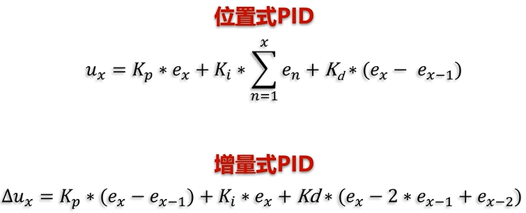  
  位置式 PID 和增量式 PID 本质上是同一个公式。

#### 各项含义


U = P + I + D

1. P = Kp\*(目标值-瞬时值)，单独调节无法达到目标值，而且会出现波动
2. I = Ki*[(目标瞬时值-目标值)+(上一秒的瞬时值-目标值)+...]*dt(时间间隔)
3. D = Kd\*[(目标值瞬时值-目标值)+(上一秒的瞬时值-目标值)]/dt(时间间隔)

4. Kp:更快达到目标值，在只有积分控制下，**会出现转速波动和稳态误差这两个问题**。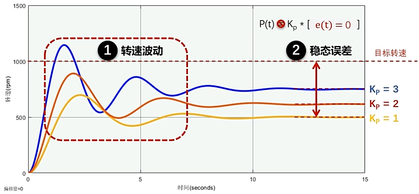
5. Kd:相当于一个阻尼器，转速远离目标值时，阻止远离。转速靠近目标值时，阻止靠近。**可以用于消除转速波动问题**。
6. Ki:用于消除稳态误差，根据积分控制部分的公式，当实际值小于目标值时，对这部分偏差进行正向积分，在积分的作用下，积分控制的输出变得越来越大，因此输出也变得越来越大。当实际值大于目标值时，对偏差部分进行负向积分，减小输出。**可以用于消除稳态误差问题**。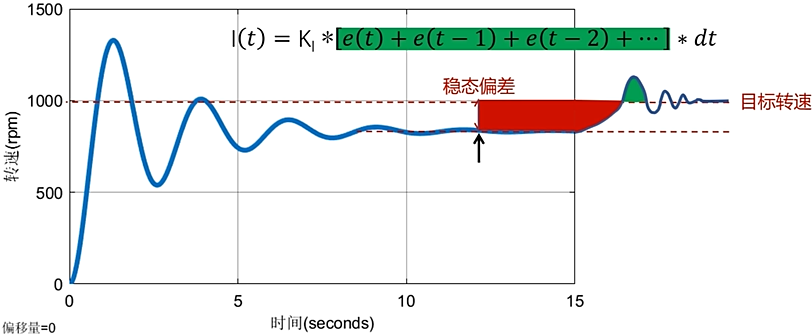
   想要实现的效果：快准稳。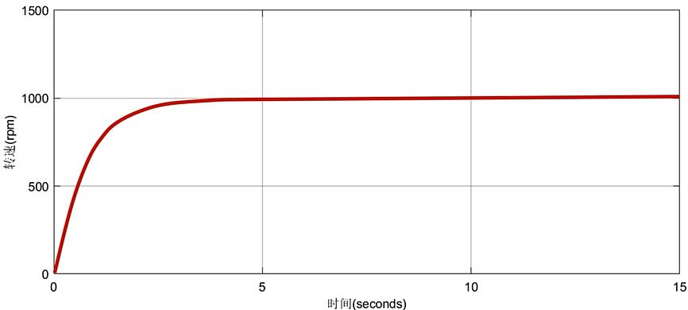

### ESP32 PWM输出
占空比越高，输出的有效电压越高，占空比越低，输出的有效电压越低。
* PWM:脉冲宽度调制，简称脉宽调制
* 频率(f):1秒PWM有多少个周期(单位Hz)
* 周期(T):一个周期多少时间
* 占空比(duty):一个脉冲周期内，高电平的时间与整个周期时间的比例
* 脉宽时间：一个周期内高电平时间
#### ESP32中的LEDC(PWM控制器)
1. LEDC是指LED PWM控制器，实际上就是PWM信号产生器。主要用于控制LED的亮度和颜色，也可以产生PWM信号。
2. LED_PWM有16路通道(0~15)，即**8路高速通道(0~7)**，由80Mhz时钟驱动。**8路低速通道(8~15)**，由8Mhz时钟驱动。
产生PWM信号的流程：
1. 建立ledc通道`ledcSetup()`
2. 将GPIO口与ledc通道关联
3. Write、WriteTone、WriteNote
4. 解除GPIO口与ledc通道的关联
相关函数：
1.  `ledcSetup(uint8_t channel, double freq, uint8_t resolution_bits)`设置LEDC通道对应的频率和分辨率(占空比分辨率)
  * `channel`通道号，取值0~15
  * `freq`PWM频率
  * `resolution_bits`分辨率，取值0~20。比如设置为8，就可以把一个周期分为$2^8=256$等分
ledc频率与分辨率的关系：
)     
常用配置频率及精度：
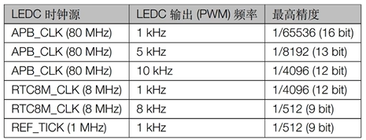    
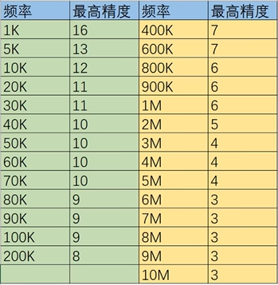
2. `ledcAttachPin(uint8_t pin, uint8_t  chan)`将LEDC通道绑定到指定GPIO口上以实现输出，**一个通道可以同时绑定到多个GPIO口上**。
3. `ledcDetachPin(uint8_t pin)`;解除GPIO的LEDC功能
4. `ledcWrite(uint8_t  chan, uint32_t  duty)`设置指定ledc通道的占空比(0~$2^bit$)
#### 示例程序
```c
void setup()
{
int ret = 0;
Serial.begin(115200);
int ch0 = 0;
int gpio4 = 4;

ret = ledcSetup(ch0,5000,12);  // ledc初始化
if(ret == 0){
  Serial.println("Error Setup");
}
else
  Serial.println("Success Setup");

ledcAttachPin(gpio4, ch0);  // 将GPIO口与ledc通道关联
ledcWrite(ch0,pow(2,11)); // 占空比50%，因为分辨率为12位，pow(2,11)占50%
}
void loop(){}
```
### 编程思路
1. MPU6050陀螺仪角度方向和平衡角度测试
2. 马达的驱动方向和死区大小测试
#### MPU6050使用测试
```c
#include <Arduino.h>
#include <Wire.h>
#include <MPU6050_tockn.h>

MPU6050 mpu6050(Wire);

void setup()
{
  Serial.begin(115200);
  Wire.begin();
  mpu6050.begin();
  // mpu6050.calcGyroOffsets(true);
}
void loop()
{
  mpu6050.update();
  Serial.print("angleZ : ");
  Serial.println(mpu6050.getAngleZ()); // 偏航角
  Serial.print("\t GyroZ : ");
  Serial.println(mpu6050.getGyroZ()); // 偏航角速度
  delay(50);
}
```
#### 马达死区测试